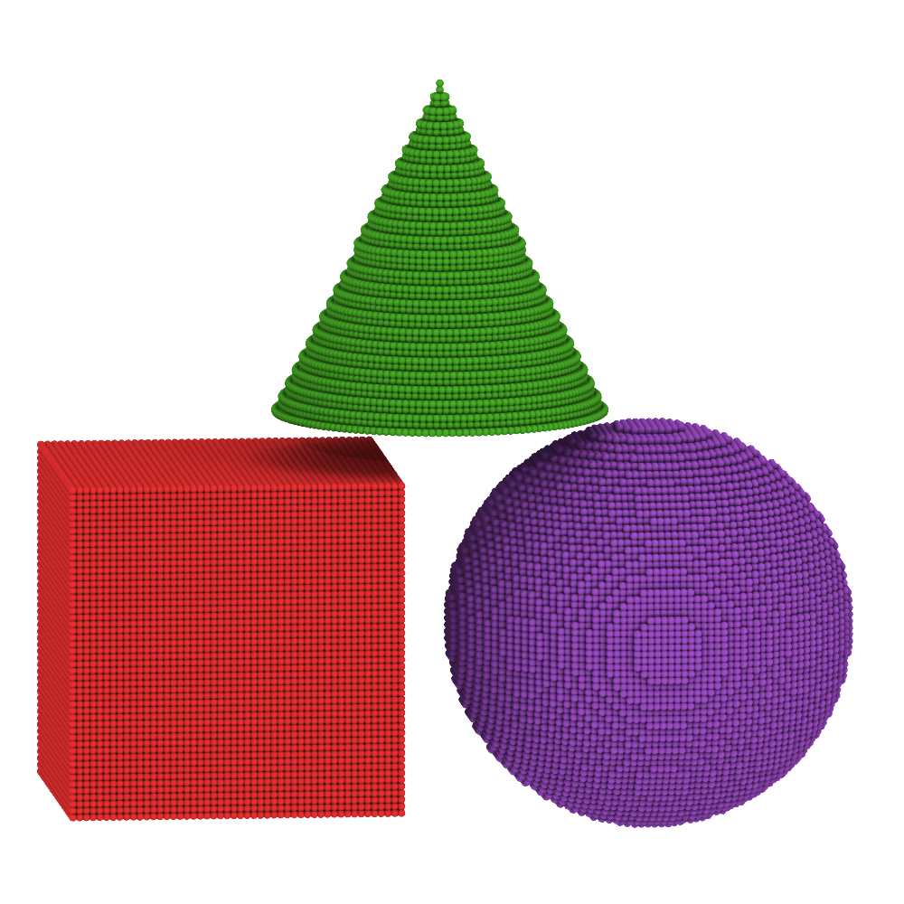

# PDMesh.jl

[](https://codecov.io/gh/ravinderbhattoo/PDMesh.jl) [](https://ravinderbhattoo.github.io/PDMesh.jl)





__PDMesh provides a set of tools to generate meshes of complex geometries and to perform various operations on them.__

Please refer to [documentation](https://ravinderbhattoo.github.io/PDMesh.jl) for more information.

## Installation
```julia
using Pkg
Pkg.add("https://github.com/ravinderbhattoo/PDMesh.jl")
```
