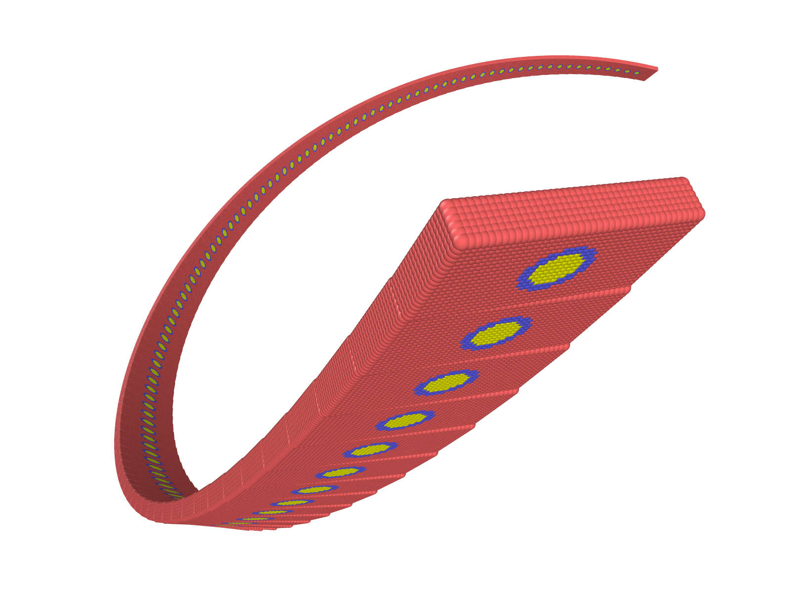

# Examples

__Output files can be visualized using Ovito software.__

## Cone
This Julia code creates a material-point-geometry of a cone and saves it to a file called `cone.data` in the `output` directory.

- `using PDMaterialPoints`: imports the `PDMaterialPoints` package, which provides a set of functions for creating and manipulating 3D material-point-geometries.
- `println("Creating Cone...")`: prints a message to the console indicating that the material-point-geometry creation process has started.
- `out = create(Cone(10.0, 20.0), resolution=0.5, rand_=0.0)`: creates a material-point-geometry of a cone with a base radius of `10.0` and a height of `20.0` using the [`create`](@ref) function provided by `PDMaterialPoints`. The `resolution` argument controls the material-point-geometry resolution, and the `rand_` argument controls the amount of random noise to add to the material-point-geometry vertices (in this case, no noise is added).
- `write_data("./output/cone.data", out)`: writes the material-point-geometry data stored in `out` to a file called `cone.data` in the `output` directory. The data is stored in a format that can be read by various visualization software packages.

```julia
using PDMaterialPoints
println("Creating Cone...")
out = create(Cone(10.0, 20.0), resolution=0.5, rand_=0.0)
write_data("./output/cone.data", out)
```

## Cylinder
This code creates a 3D cylinder using the [`create`](@ref) function. The [`Cylinder`](@ref) function is used to define the geometry of the cylinder. It takes three arguments:

- The radius of the cylinder, which is set to 10.0.
- The height of the cylinder, which is set to 3.0.
- The number of segments used to create the cylinder, which is set to 100.

The [`create`](@ref) function is then called with the cylinder object as the first argument. The second argument, `resolution`, specifies the desired resolution of the material point geometry, which is set to 0.5 in this case. The third argument, `rand_`, specifies the randomness of the material point geometry, which is set to 0.0 in this case.

Finally, the [`write_data`](@ref) function is called to write the material-point-geometry data to a file. The first argument is the path and filename of the output file, which is set to "./output/cylinder.data". The second argument is the material-point-geometry data object returned by the [`create`](@ref) function.

```julia
using PDMaterialPoints
println("Creating Cylinder...")
out = create(Cylinder(10.0, 3.0, 100.0), resolution=0.5, rand_=0.0)
write_data("./output/cylinder.data", out)
```

## Sphere
The [`create`](@ref) function is called to generate the sphere. This function takes in two arguments: the first is the shape of the object to be created (in this case, a [`Sphere`](@ref) with a radius of 10.0), and the second argument is a resolution parameter, which controls the level of detail in the material-point-geometry. The smaller the resolution value, the finer the material-point-geometry.

The [`create`](@ref) function returns a material-point-geometry object, which is stored in the `out` variable.

Finally, the [`write_data`](@ref) function is called to write the material-point-geometry data to a file called "sphere.data" in the "./output" directory.
```julia
using PDMaterialPoints
println("Creating Sphere...")
out = create(Sphere(10.0), resolution=0.5, rand_=0.0)
write_data("./output/sphere.data", out)
```

## Notched Bar

This code generates a notched bar shape. A cuboid is created using the [`Cuboid`](@ref) function, which takes as input a matrix with the ranges of the x, y, and z axes of the cuboid. In this case, the cuboid has ranges of -10 to 10 in the x-axis, 0 to 3 in the y-axis, and -2 to 2 in the z-axis. This creates a cuboid with a rectangular prism shape.

Next, a function `f` is defined that takes in the `out` dictionary that contains information about the material point geometry, including the coordinates `x` and the type of each point in the material-point-geometry. The function returns a boolean mask that is true for the points that meet the specified condition. In this case, `f` masks all points that have an x-coordinate between -0.1 and 0.1 and a y-coordinate greater than 2.

The [`delete`](@ref) function is then called on the `obj` cuboid using `f` as the input. This deletes all the points in the material-point-geometry that satisfy the boolean mask generated by `f`, which creates a notch in the bar shape.

Finally, the [`create`](@ref) function is called on the modified `obj` material-point-geometry to create a new material-point-geometry with a higher resolution (0.1) and no randomness in the material-point-geometry (`rand_=0.0`). The type of each point is set to 1 (`type=1`). The resulting material-point-geometry is written to a data file named "notched_bar.data" in the "./output" directory.

```julia
using PDMaterialPoints
println("Creating Notched Bar...")
obj = Cuboid([-10 10; 0 3; -2 2])
f = out -> begin
    x=out[:x];
    mask = (x[1, :] .< 0.1) .& (x[1, :] .> -0.1) .& (x[2, :] .> 2)
    mask
end
obj = delete(obj, f)

out = create(obj, resolution=0.1, rand_=0.0, type=1)
write_data("./output/notched_bar.data", out)
```

```@raw html

```


## Composite
In this example, a [`Cuboid`](@ref) is created initially and then its type is modified using the [`changetype`](@ref) function inside the for loop.

In each iteration of the loop, a new center and radius is generated randomly. The [`changetype`](@ref) function is then called to modify the `obj` by creating a boolean mask of the points inside a sphere with the generated center and radius. The mask is created using the Euclidean distance formula `(x - center)^2 < radius^2`. The mask is also modified to exclude any points that already have a type of 2, which in this case is the type for spheres.

The [`changetype`](@ref) function is called with a `type` argument of 2 to set the type of the masked points to 2, which changes them to spheres. Since [`changetype`](@ref) modifies the `obj` in place, the `obj` variable is declared as global at the beginning of each loop iteration.

Finally, the [`create`](@ref) function is called on the modified `obj` with a resolution of 0.1 and a `rand_` argument of 0.0 to create a material-point-geometry of the composite object. The material-point-geometry is then written to a file using the [`write_data`](@ref) function.

```julia
println("Creating a composite...")
function rand_(a, b)
    return a + rand()*(b-a)
end

obj = Cuboid([-10 10; -10 10; 0 3])
for i in 1:100
    global obj
    center = [rand_(-10, 10), rand_(-10, 10), rand_(0, 3)]
    radius = 0.2 + 1.0*rand()
    obj = changetype(obj, out -> begin x=out[:x]; mask = sum((x .- vec(center)).^2, dims=1) .< radius^2; mask .& (sum(out[:type][mask[1,:]] .== 2) == 0)  end, 2)
end

out = create(obj, resolution=0.1, rand_=0.0, type=1)
write_data("./output/composite.data", out)
```

```@raw html

```

## Rotating composite strip
In this example, a rotating strip is being created by repeatedly modifying a cuboid `obj` and adding it to the existing object by calling the [`combine`](@ref) method.

Initially, `obj` is set to be a cuboid with dimensions `[-5 5; -10 10; 0 3]`.

In each iteration of the for-loop, `obj` is modified in the following ways:
- The [`changetype`](@ref) method is called twice to change the type of some of the point-particles. The first call changes the type of point-particles that satisfy the condition `sum(x[1:2, :].^2, dims=1) .< 3.0^2` to 2, and the second call changes the type of point-particles that satisfy the condition `sum(x[1:2, :].^2, dims=1) .< 2.0^2` to 3.
- The [`move`](@ref) method is called to translate `obj` by `[10.0, 0.0, 0.0]`.
- The [`rotate`](@ref) method is called to rotate `obj` by an angle of `2` degrees around a point `[0.0, 0.0, 0.0]` and an axis vector `[1.0, 1.0, 0.0]`.

Finally, after the for-loop completes, [`create`](@ref) method is called to generate the material-point-geometry data for the combined object, with a resolution of `0.5` and no random noise, and the result is written to a file named `strip.data`.

```julia
println("Creating rotating strip...")
using PDMaterialPoints
c = Cuboid([-5 5; -10 10; 0 3])
obj = copy(c)
for i in 1:100
    global obj
    obj = changetype(obj, out -> begin x=out[:x]; sum(x[1:2, :].^2, dims=1) .< 3.0^2 end, 2)
    obj = changetype(obj, out -> begin x=out[:x]; sum(x[1:2, :].^2, dims=1) .< 2.0^2 end, 3)
    obj = move(obj, by=[10.0, 0.0, 0.0])
    obj = rotate(obj, angle=2, point=[0.0, 0.0, 0.0], vector_=[1.0, 1.0, 0.0])
    obj = combine(obj, c)
end

out = create(obj, resolution=0.5, rand_=0.0, type=1)
write_data("./output/strip.data", out)
```

```@raw html

```
